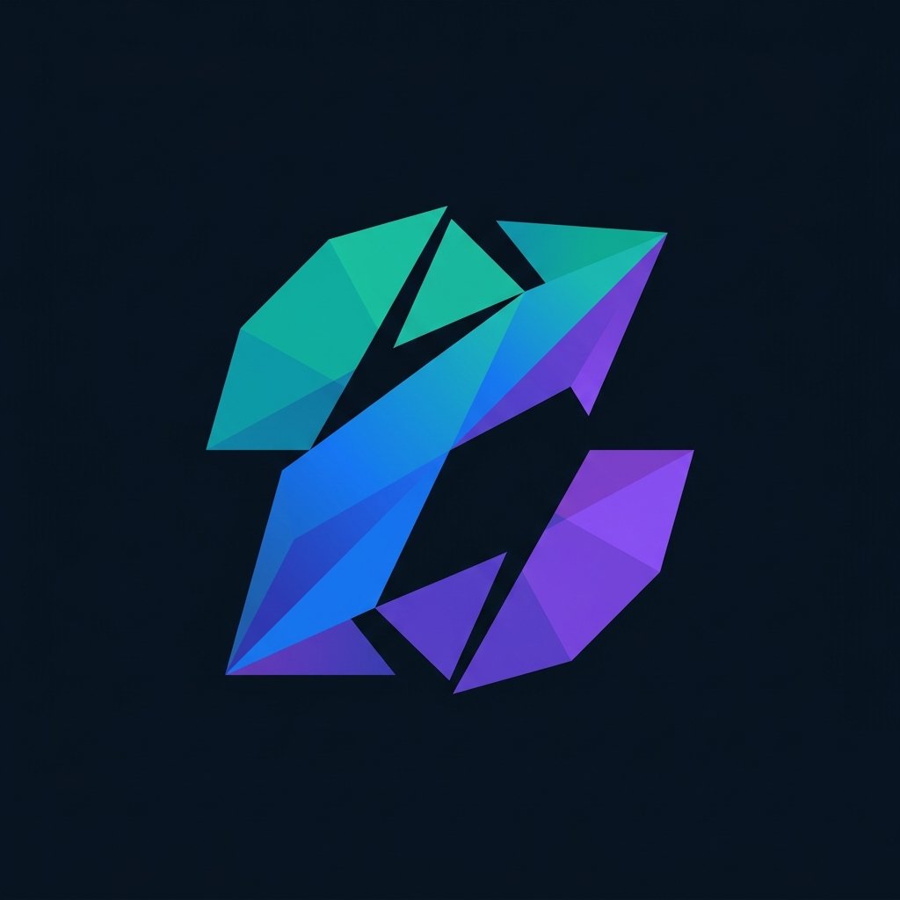

<div align="center">



# ChromaShift

**Deterministic UI theme remapper — browser-side, API-free, instant output.**

Upload a product screenshot or SVG, extract its color structure, remap it into polished theme variants, and export production-ready tokens. No AI APIs, no backend, no signup.

[Try the Demo →](#getting-started) · [How It Works](#how-it-works) · [Architecture](#architecture) · [Deploy](#deploy)

</div>

---

## ✨ Features

| | Feature | Description |
|---|---|---|
| 🎨 | **Semantic role detection** | Infers background, surface, text, accent, and border roles from extracted palette clusters — not blind hue swaps |
| 🔄 | **6 built-in presets** | Dark, Modern SaaS, Pastel, Cyberpunk, Monochrome, Accessibility — each applies intelligent semantic remapping |
| 🎯 | **Custom palette import** | Paste colors from coolors.co (CSV, JSON, hex, XML, URL) and apply as a custom theme |
| 🖼️ | **Live before/after slider** | Drag-to-compare split view with original, remapped, and side-by-side modes |
| ♿ | **Accessibility scoring** | Real-time WCAG contrast auditing with per-pair reports |
| 📦 | **Multi-format export** | Global CSS variables, Tailwind theme snippets, and JSON token payloads |
| ⚡ | **Fully client-side** | All processing runs in the browser — no uploads to external servers |
| 🔬 | **Advanced color science** | CIEDE2000 perceptual distance, bilateral pre-filtering, OKLCH lightness-relative remapping |

---

## 🚀 Getting Started

### Prerequisites

- **Node.js** ≥ 18
- **pnpm** (recommended) or npm

### Install & Run

```bash
# Clone the repository
git clone https://github.com/your-username/chroma-shift.git
cd chroma-shift

# Install dependencies
pnpm install

# Start development server
pnpm dev
```

Open **http://localhost:3000** → click **Try the workspace** → upload a screenshot or try the sample dashboard.

---

## 🔬 How It Works

```
Upload PNG/JPEG/SVG
       │
       ▼
┌──────────────────┐
│ Bilateral Filter │  ← Smooths shadow gradients, preserves hard edges
└──────┬───────────┘
       ▼
┌──────────────────┐
│ Weighted k-Means │  ← Lightness down-weighted (×0.3) so shadows cluster together
│ + k-means++ init │
└──────┬───────────┘
       ▼
┌──────────────────┐
│ Cluster Splitting│  ← Splits any cluster with >28 L* range into light/dark bands
└──────┬───────────┘
       ▼
┌──────────────────┐
│ CIEDE2000 Merge  │  ← Adaptive perceptual threshold (5–10 ΔE*₀₀)
└──────┬───────────┘
       ▼
┌──────────────────┐
│ Semantic Roles   │  ← Assigns background, surface, text, accent, border
└──────┬───────────┘
       ▼
┌──────────────────┐
│ Theme Tokens     │  ← Generates target palette from preset or custom colors
└──────┬───────────┘
       ▼
┌──────────────────┐
│ OKLCH Remap      │  ← Lightness-relative: preserves depth, shadows, gradients
│ L×0.82, C×0.45   │
└──────┬───────────┘
       ▼
   Remapped PNG/SVG + CSS/JSON/Tailwind exports
```

### Key Innovation

Traditional screenshot recoloring **flat-replaces** each pixel with the nearest theme token, producing posterized, depth-less output. ChromaShift preserves the **lightness delta** between each pixel and its matched centroid in OKLCH space:

```
remapped.L = target.L + (pixel.L − centroid.L) × 0.82
remapped.C = target.C + (pixel.C − centroid.C) × 0.45
remapped.H = target.H
```

This keeps shadows, gradients, and anti-aliased edges intact through the remap.

---

## 🏗️ Architecture

```
src/
├── app/
│   ├── layout.tsx              # Root layout, fonts, metadata, OG tags
│   ├── page.tsx                # Landing page
│   ├── globals.css             # Design tokens, light/dark theme
│   └── try/page.tsx            # Workspace page
├── components/
│   ├── workspace/
│   │   ├── analysis-workspace  # Main orchestrator: upload → analyze → remap → export
│   │   ├── theme-preset-rail   # Built-in preset selector
│   │   └── custom-palette-input# Paste-from-coolors custom palette UI
│   ├── preview/                # Before/after split slider
│   ├── palette/                # Extracted color inspector
│   ├── accessibility/          # WCAG contrast report panel
│   ├── export/                 # CSS/JSON/Tailwind export panel
│   └── ui/                     # Shared primitives (Button, Card, Badge)
├── lib/
│   ├── color/
│   │   ├── extract.ts          # Bilateral filter → weighted k-means → CIEDE2000 merge
│   │   ├── semantic.ts         # OKLCH-based semantic role inference
│   │   ├── remap.ts            # Lightness-relative per-pixel remapping
│   │   ├── themes.ts           # Preset + custom palette token generation
│   │   ├── parse-palette.ts    # Universal palette parser (CSV, JSON, XML, URL)
│   │   ├── accessibility.ts    # WCAG contrast scoring
│   │   └── types.ts            # Shared type definitions
│   └── export/
│       ├── css.ts              # Global CSS variable generator
│       └── payloads.ts         # Tailwind snippet + JSON payload builders
```

---

## 🧰 Tech Stack

| Layer | Technology |
|---|---|
| Framework | Next.js 16, React 19, TypeScript |
| Styling | Tailwind CSS 4, CSS custom properties |
| UI Components | shadcn/ui primitives, Framer Motion |
| Color Science | [culori](https://culorijs.org/) (OKLCH, CIEDE2000), [chroma-js](https://gka.github.io/chroma.js/) |
| SVG Parsing | svgson |
| Icons | Lucide React |

---

## 🌐 Deploy

### Vercel (recommended)

```bash
# One-click deploy
npx vercel

# Or connect your GitHub repo at vercel.com/new
```

Set the environment variable for OG image URLs:
```
NEXT_PUBLIC_SITE_URL=https://your-domain.com
```

### Netlify

```bash
# Build command
pnpm build

# Publish directory
.next
```

> **Note:** For Netlify, you'll need the [Next.js runtime plugin](https://docs.netlify.com/frameworks/next-js/) or export as static with `output: 'export'` in `next.config.ts`.

---

## 📄 License

MIT — free for personal and commercial use.

---

<div align="center">

**Built for demo-day impact.** Upload a screenshot, pick a theme, share the result.

</div>
